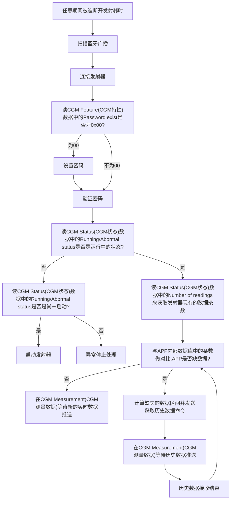

# 持续葡萄糖监测系统DN发射器接口文档说明


#### 版本:V1.2

#### 编制:陈苏阳

#### 日期:2024年12月23日


<table>
<thead>
<tr>
<th align="center" colspan="3")>文档修改记录</th>
</tr>
</thead>
<tbody><tr>
<td align="left">版本号</td>
<td align="left">修改内容</td>
<td align="left">修改时间</td>
</tr>
<tr>
<td align="left">V1.1</td>
<td align="left">初稿</td>
<td align="left">2024.12.16</td>
</tr>
<tr>
<td align="left">V1.2</td>
<td align="left">增加CRC的章节</td>
<td align="left">2024.12.23</td>
</tr>
</tbody></table>


## 目录

1.[项目描述](#项目描述)
2.[BLE接口概览](#接口概览)
3.[接口说明](#接口说明)
3.1.[CGM测量数据](#CGM测量数据)
3.2.[CGM特性](#CGM特性)
3.3.[CGM状态](#CGM状态)
3.4.[记录存取控制点](#记录存取控制点)
3.5.[CGM轮次开始时间](#CGM轮次开始时间)
3.6.[特殊操作控制点](#特殊操作控制点)
3.7.[制造商名称](#制造商名称)
3.8.[型号名称](#型号名称)
3.9.[硬件版本](#硬件版本)
3.10.[固件版本](#固件版本)
3.11.[软件版本](#软件版本)
3.12.[电池电量](#电池电量)
4.1.[pkcs7概述与示例代码](#pkcs7)
4.2.[AES加密概述与示例代码](#AES)
4.3.[设置密码命令额外说明](#AdditionalInstructionsForPasswordCommand)
4.4.[启动发射器命令额外说明](#LaunchCommandAdditionalInstructions)
4.5.[建议与发射器的交互流程](#FlowOfInteraction)
4.6[CRC概述与示例代码](#CRC)


<h2 id="项目描述">项目描述</h2>

DN发射器与App，传感器组成持续葡萄糖监测系统，实现持续监测患者血糖的功能。发射器从传感器端获取电信号转化为血糖信号，并以一定的时间间隔通过蓝牙通信发送到手机端。手机端可以通过蓝牙通信与发射器交互，通过命令控制发射器的运行状态。


<h2 id="接口概览">BLE接口概览</h2>

- **Continuous Glucose Monitoring(持续血糖监测服务) 服务UUID:181F**

  [CGM Measurement(CGM测量数据) 特征UUID:2AA7](#CGM测量数据)
  
  ​	*支持的属性:Notification* 
  
  ​	*用途:用于获取发射器的实时血糖数据与历史血糖数据*
  
  [CGM Feature(CGM特性) 特征UUID:2AA8](#CGM特性)
  
  ​	*支持的属性:Read*
  
  ​	*用途:读取由APP设置的一些特性和本身的一些特性*
  
  [CGM Status(CGM状态) 特征UUID:2AA9](#CGM状态)
  
  ​	*支持的属性:Read*
  
  ​	*用途:读取发射器的运行状态*
  
  [Record Access Control Point(记录存取控制点) 特征UUID:2A52](#记录存取控制点)
  
  ​	*支持的属性:Write/Write without response/Notify/Indicate*
  
  ​	*用途:与发射器进行历史数据相关的命令交互操作*
  
  [CGM Session Start Time(CGM轮次开始时间) 特征UUID:2AAA](#CGM轮次开始时间)
  
  ​	*支持的属性:Read*
  
  ​	*用途:读取发射器本轮次的启动时间*与运行时间
  
  [CGM Specific Ops Control Point(特殊操作控制点) 特征UUID:2AAC](#特殊操作控制点)
  
  ​	*支持的属性:Write/Write without response/Notify/Indicate*
  
  ​	*用途:通过发送命令向发射器传递特性和控制发射器*
  
- **BatteryService(电池服务) 服务UUID:180F**

  [Battery Level(电池电量) 特征UUID:180F](#电池电量)

  ​	*支持的属性:Read/Notification* 

  ​	*用途:获取当前发射器电量百分比*

- **Device Information(设备信息服务) 服务UUID:180A**

​	[Manufacturer Name(制造商名称)  特征UUID:2A24](#制造商名称)

​		*支持的属性:Read*

​		*用途:按ASCII读取,内容为Infinovo*

​	[Model Name(型号名称) 特征UUID:2A25](#型号名称)

​		*支持的属性:Read*

​		用途:按ASCII读取,内容为DN

​	[Hardware Revision(硬件版本) 特征UUID:2A27](#硬件版本)

​		*支持的属性:Read*

​		*用途:按ASCII读取,内容为000*

​	[Software Revision(软件版本) 特征UUID:2A28](#软件版本)

​		*支持的属性:Read*

​		*用途:按ASCII读取,内容为0.2.4*


<h2 id="接口说明">接口说明</h2>

<h3 id="CGM测量数据">CGM Measurement(CGM测量数据)</h3>


特征UUID:2AA7

支持的属性:Notification

<table>
<thead>
<tr>
<th>字段</th>
<th>类型</th>
<th>字段说明</th>
</tr>
</thead>
<tbody><tr>
<td align="left">Len</td>
<td align="left" nowrap="nowrap">无符号1字节</td>
<td align="left">表示该条数据的长度</td>
</tr>
<tr>
<td align="left" rowspan="2">Offset</td>
<td align="left" nowrap="nowrap">无符号1字节</td>
<td align="left">该条血糖从启动开始计数的第几个广播数据的序列号，从0开始，转化为双字节16进制，低字节在前</td>
</tr>
<tr>
<td align="left" nowrap="nowrap">无符号1字节</td>
<td align="left">序列号的高字节</td>
</tr>
<tr>
<td align="left" rowspan="2">Glucose</td>
<td align="left" nowrap="nowrap">无符号1字节</td>
<td align="left">该条血糖的数值（mmol/L的单位）*10，转化为双字节16进制，低字节在前</td>
</tr>
<tr>
<td align="left" nowrap="nowrap">无符号1字节</td>
<td align="left">血糖值的高字节</td>
</tr>
<td align="left">Is_History</td>
<td align="left" nowrap="nowrap">无符号1字节</td>
<td align="left">是否为历史数据，是为0x80，不是为0x00</td>
</tr>
<tr>
<td align="left">Trend</td>
<td align="left" nowrap="nowrap">无符号1字节</td>
<td align="left">与之前的血糖值相比的每分钟变化率，从0x01-0x07共7个档，表示快速下降，下降，缓慢下降，平稳，缓慢上升，上升和快速上升；默认值0x00，表示不支持趋势计算</td>
</tr>
<tr>
<td align="left" rowspan="2">Current</td>
<td align="left" nowrap="nowrap">无符号1字节</td>
<td align="left">该条血糖的电流值（nA）*100，转化为双字节16进制，低字节在前</td>
</tr>
<tr>
<td align="left" nowrap="nowrap">无符号1字节</td>
<td align="left">电流值的高字节</td>
</tr>
<tr>
<td align="left" rowspan="2">Quality</td>
<td align="left" nowrap="nowrap">无符号1字节</td>
<td align="left">0x00:正常，0x01:血糖过低，0x02:血糖过高，0x03:预留</td>
</tr>
<tr>
<td align="left" nowrap="nowrap">无符号1字节</td>
<td align="left">0x00</td>
</tr>
<tr>
<td align="left">Status</td>
<td align="left" nowrap="nowrap">无符号1字节</td>
<td align="left">0x00：正常<br>
0x08：到期停止<br>
0x33: 极化过程中<br>
0x41: 大电流<br>
0x42: 小电流<br>
0x43: CV异常<br>
0x24: 大电流停止<br>
0x25: 小电流停止<br>
0x26: CV停止
</tr>
<tr>
<td align="left">CV</td>
<td align="left" nowrap="nowrap">无符号1字节</td>
<td align="left">转换成整数后除以100</td>
</tr>
<tr>
<td align="left" rowspan="2">CRC16</td>
<td align="left" nowrap="nowrap">无符号1字节</td>
<td align="left">CRC校验低字节在前</td>
</tr>
<tr>
<td align="left" nowrap="nowrap">无符号1字节</td>
<td align="left">CRC校验的高字节</td>
</tr>
</tbody></table>


<h4 id="加密">加密:</h4>

CGM测量数据需要进行加密，加密方法为AES128加密方法；模型为ECB

**初始秘钥为：0x2B7E151628AED2A6ABF7158809CFACEF**

其中后四位ACEF，为用户设置的密码（见4.3.1）的16进制值低字节在前。

用户设置密码后，补全后四位，替换掉ACEF，组成该用户的特殊密码。

历史数据同样需要加密。

#### 历史数据:

历史数据包通过[CGM Measurement(CGM测量数据)特征](#CGM测量数据)发送，历史数据包的长度是固定不变的，是16字节长度。

历史数据包优先发送最新历史数据。

#### 其他数据:

当某一次历史数据发送结束时,发射器会在[CGM Measurement(CGM测量数据)特征](#CGM测量数据)中发一条代表历史数据发送结束的特殊数据包,其结构如下:

<table>
<thead>
<tr>
<th>值</th>
<th>类型</th>
<th>字段说明</th>
</tr>
</thead>
<tbody><tr>
<td align="left">0xAA</td>
<td align="left" nowrap="nowrap">无符号1字节</td>
<td align="left">历史数据发送结束标志位</td>
</tr>
<tr>
<td align="left">0x00</td>
<td align="left" nowrap="nowrap">无符号1字节</td>
<td align="left">无效填充</td>
</tr>
<tr>
<td align="left">0x00</td>
<td align="left" nowrap="nowrap">无符号1字节</td>
<td align="left">无效填充</td>
</tr>
<tr>
<td align="left" rowspan="2">CRC16</td>
<td align="left" nowrap="nowrap">无符号1字节</td>
<td align="left">CRC校验低字节在前</td>
</tr>
<tr>
<td align="left" nowrap="nowrap">无符号1字节</td>
<td align="left">CRC校验的高字节</td>
</tr>
</tbody></table>

当某一次历史数据发送出错时,发射器会在[CGM Measurement(CGM测量数据)特征](#CGM测量数据)中发一条代表历史数据发送出错的特殊数据包,其结构如下(当历史数据发送出错时,需要APP重新设置区间再次读取历史数据):

<table>
<thead>
<tr>
<th>值</th>
<th>类型</th>
<th>字段说明</th>
</tr>
</thead>
<tbody><tr>
<td align="left">0xBB</td>
<td align="left" nowrap="nowrap">无符号1字节</td>
<td align="left">历史数据发送出错标志位</td>
</tr>
<tr>
<td align="left">0x00</td>
<td align="left" nowrap="nowrap">无符号1字节</td>
<td align="left">无效填充</td>
</tr>
<tr>
<td align="left">0x00</td>
<td align="left" nowrap="nowrap">无符号1字节</td>
<td align="left">无效填充</td>
</tr>
<tr>
<td align="left" rowspan="2">CRC16</td>
<td align="left" nowrap="nowrap">无符号1字节</td>
<td align="left">CRC校验低字节在前</td>
</tr>
<tr>
<td align="left" nowrap="nowrap">无符号1字节</td>
<td align="left">CRC校验的高字节</td>
</tr>
</tbody></table>

为保证方法的统一，历史数据错误和历史数据结束的广播同样需要加密。


<h3 id="特殊操作控制点">CGM Specific Ops Control Point(特殊操作控制点)</h3>


 特征UUID:2AAC

支持的属性:Write/Write without response/Notify/Indicate

注意：除了[设置密码命令](#设置密码)加密方式不同以外，其他命令均需要加密，方法同[CGM测量数据加密](#加密)中的方法。发射器解密后，如果不能识别则被判定为非法数据包，按照[非法命令](#非法命令)的回复内容进行回复。


<h4 id="设置密码">设置密码:</h4>

命令说明：

​	发射器首次连接的时候为开放连接，密码为空，此时发射器不接受任何的其他命令，只在限定的时间范围内等待设置密码的命令（超时断开连接），对于第一个使用该发射器的用户，需要设置密码；是否需要设置密码应从“[CGM Feature(CGM特性) 特征](#CGM特性)”获得。没有设置密码的时候发送任何命令会立即断开，不会产生返回值。

​	用户设置的密码为4位数字，两两拆分转化为两个字节的16进制数。如1234，转化为0x12 0x34。

​	用户设置的密码报文按照AES128加密的方法，模型为ECB。

​	设置密码命令使用的固定秘钥为：0x2B7E151628AED2A6ABF7158809CF**+**ACEF

​	报文内容为用户设置密码明文2字节+发射器序列号内的所有字符均使用ASCII转化为16进制值。加密前总长度要<=15个字节。最后整个报文总长度17字节。

##### 设置密码命令数据包结构说明:

<table>
<thead>
<tr>
<th>字段</th>
<th>类型</th>
<th>字段值</th>
<th>字段说明</th>
</tr>
</thead>
<tbody><tr>
<td align="left">Op_code</td>
<td align="left" nowrap="nowrap">无符号1字节</td>
<td align="left">0x7A</td>
<td align="left">操作数(不加密)</td>
</tr>
<tr>
<td align="left" rowspan="2">Password</td>
<td align="left" nowrap="nowrap">无符号1字节</td>
<td align="left"></td>
<td align="left">密码低字节</td>
</tr>
<tr>
<td align="left" nowrap="nowrap">无符号1字节</td>
<td align="left"></td>
<td align="left">密码高字节</td>
</tr>
<tr>
<td align="left">SN</td>
<td align="left" nowrap="nowrap">无符号1字节*7</td>
<td align="left"></td>
<td align="left">7个字节长度,例如DN-ABC1234,低字节从A开始(省略DN-)</td>
</tr>
</tbody></table>

###### 注:不满16字节按照[pkcs7](#pkcs7)填充。按照aes128固定密钥加密生成16字节加密数据。

​	发射器根据操作数判断，收到设置密码命令后，先解密依次获取密码和发射器序列号，发射器序列号与本地存储的发射器序列号对比，如果相同则通过，保存密码及新生成的秘钥，并等待验证密码。

##### 设置密码命令回应数据包结构说明:

<table>
<thead>
<tr>
<th>字段</th>
<th>类型</th>
<th>字段值</th>
<th>字段说明</th>
</tr>
</thead>
<tbody><tr>
<td align="left">Flag</td>
<td align="left" nowrap="nowrap">无符号1字节</td>
<td align="left">0x1C</td>
<td align="left">表示该返回值是合法返回值</td>
</tr>
<tr>
<td align="left">Op_code</td>
<td align="left" nowrap="nowrap">无符号1字节</td>
<td align="left">0x7A</td>
<td align="left">表示对应的是设置密码的返回值</td>
</tr>
<tr>
<td align="left">Result</td>
<td align="left" nowrap="nowrap">无符号1字节</td>
<td align="left">0x01<br>
    0x02<br>
    0x03<br>
    0x04<br>
    0x05<br>
    0x06
    </td>
<td align="left">0x01:设置成功<br>
    0x02:命令格式不正确<br>
    0x03:命令长度不正确<br>
    0x04:已有密码<br>
    0x05:序列号错误<br>
    0x06:报文无法解密
    </td>
</tr>
<tr>
<td align="left" rowspan="2">CRC16</td>
<td align="left" nowrap="nowrap">无符号1字节</td>
<td align="left"></td>
<td align="left">CRC校验低字节在前</td>
</tr>
<tr>
<td align="left" nowrap="nowrap">无符号1字节</td>
<td align="left"></td>
<td align="left">CRC校验的高字节</td>
</tr>
</tbody></table>


<h4 id="验证密码">验证密码:</h4>

命令说明：

​	**此条需要加密**。对于已设置密码的发射器，连接成功后，未发送密码之前，此时发射器不接受任何的其他命令，且不发送实时数据或历史数据，只在限定的时间范围内等待发送密码的命令（超时断开连接）。没有发送密码并校验成功的时候发送任何命令会立即断开，不会产生返回值；

##### 验证密码命令数据包结构说明:

<table>
<thead>
<tr>
<th>字段</th>
<th>类型</th>
<th>字段值</th>
<th>字段说明</th>
</tr>
</thead>
<tbody><tr>
<td align="left">Op_code</td>
<td align="left" nowrap="nowrap">无符号1字节</td>
<td align="left">0x7B</td>
<td align="left">操作数</td>
</tr>
<tr>
<td align="left">Operation</td>
<td align="left" nowrap="nowrap">无符号1字节</td>
<td align="left">0x00</td>
<td align="left">无效填充</td>
</tr>
<tr>
<td align="left"  rowspan="2">Password</td>
<td align="left" nowrap="nowrap">无符号1字节</td>
<td align="left"></td>
<td align="left">App需要发送的4位密码，转化为16进制后，低字节在前发送</td>
</tr>
<tr>
<td align="left" nowrap="nowrap">无符号1字节</td>
<td align="left"></td>
<td align="left">密码的高字节</td>
</tr>
<tr>
<td align="left" rowspan="2">CRC16</td>
<td align="left" nowrap="nowrap">无符号1字节</td>
<td align="left"></td>
<td align="left">CRC校验低字节在前</td>
</tr>
<tr>
<td align="left" nowrap="nowrap">无符号1字节</td>
<td align="left"></td>
<td align="left">CRC校验的高字节</td>
</tr>
</tbody></table>


##### 验证密码命令回应数据包结构说明:

<table>
<thead>
<tr>
<th>字段</th>
<th>类型</th>
<th>字段值</th>
<th>字段说明</th>
</tr>
</thead>
<tbody><tr>
<td align="left">Flag</td>
<td align="left" nowrap="nowrap">无符号1字节</td>
<td align="left">0x1C</td>
<td align="left">表示该返回值是合法返回值</td>
</tr>
<tr>
<td align="left">Op_code</td>
<td align="left" nowrap="nowrap">无符号1字节</td>
<td align="left">0x7B</td>
<td align="left">表示对应的是验证密码的返回值</td>
</tr>
<tr>
<td align="left">Result</td>
<td align="left" nowrap="nowrap">无符号1字节</td>
<td align="left">0x01<br>
    0x02<br>
    0x03<br>
    0x04<br>
    0x05
    </td>
<td align="left">0x01:校验成功<br>
    0x02:命令格式不正确<br>
    0x03:命令长度不正确<br>
    0x04:密码错误<br>
    0x05:其他错误<br>
    </td>
</tr>
<tr>
<td align="left" rowspan="2">CRC16</td>
<td align="left" nowrap="nowrap">无符号1字节</td>
<td align="left"></td>
<td align="left">CRC校验低字节在前</td>
</tr>
<tr>
<td align="left" nowrap="nowrap">无符号1字节</td>
<td align="left"></td>
<td align="left">CRC校验的高字节</td>
</tr>
</tbody></table>


<h4 id="启动发射器">启动发射器:</h4>

​	**此条需要加密。**启动发射器是指从此刻开始3min发送一次实时血糖的工作状态,并且运行时间从此刻开始累计，正式开始工作。将内容中的相对时间和from等信息记录下来，方便后面的查看。

相对时间：此时间是APP端的当前时间减一1970/00/00差值，用秒计算，使用32位整型数表示和传输。此命令执行成功后，相对时间会在[CGM Session Start Time(CGM轮次开始时间) 特征]()显示。

<table>
<thead>
<tr>
<th>字段</th>
<th>类型</th>
<th>字段值</th>
<th>字段说明</th>
</tr>
</thead>
<tbody><tr>
<td align="left">Op_code</td>
<td align="left" nowrap="nowrap">无符号1字节</td>
<td align="left">0x1A</td>
<td align="left">操作数</td>
</tr>
<tr>
<td align="left" rowspan="4">Start Time</td>
<td align="left" nowrap="nowrap">无符号1字节</td>
<td align="left">Bit0-7</td>
<td align="left">发射器启动时的时间，秒为单位计算(UTC时间戳)</td>
</tr>
<tr>
<td align="left" nowrap="nowrap">无符号1字节</td>
<td align="left">Bit8-15</td>
<td align="left">发射器启动时的时间，秒为单位计算(UTC时间戳)</td>
</tr>
<tr>
<td align="left" nowrap="nowrap">无符号1字节</td>
<td align="left">Bit16-23</td>
<td align="left">发射器启动时的时间，秒为单位计算(UTC时间戳)</td>
</tr>
<tr>
<td align="left" nowrap="nowrap">无符号1字节</td>
<td align="left">Bit24-32</td>
<td align="left">发射器启动时的时间，秒为单位计算(UTC时间戳)</td>
</tr>
<tr>
<td align="left" rowspan="2">Factory Code</td>
<td align="left" nowrap="nowrap">无符号1字节</td>
<td align="left">Bit0-7</td>
<td align="left">工厂校准码低8位</td>
</tr>
<tr>
<td align="left" nowrap="nowrap">无符号1字节</td>
<td align="left">Bit8-15</td>
<td align="left">工厂校准码高8位</td>
</tr>
<tr>
<td align="left">TimeZone</td>
<td align="left" nowrap="nowrap">无符号1字节</td>
<td align="left"></td>
<td align="left">用于存储启动时的时区参数(发射器内部本身不处理时区,只做存储)</td>
</tr>
<tr>
<td align="left">Reserved</td>
<td align="left" nowrap="nowrap">无符号1字节</td>
<td align="left"></td>
<td align="left">保留</td>
</tr>
<tr>
<td align="left">From</td>
<td align="left" nowrap="nowrap">无符号1字节</td>
<td align="left">0x01</td>
<td align="left">启动方式:安卓为0x01,iOS为0x02,接收器为0x03</td>
</tr>
<td align="left"  rowspan="3">Software Version</td>
<td align="left" nowrap="nowrap">无符号1字节</td>
<td align="left">Version1</td>
<td align="left">启动用的App或接收器的版本第一位的十六进制数</td>
</tr>
<tr>
<td align="left" nowrap="nowrap">无符号1字节</td>
<td align="left">Version2</td>
<td align="left">启动用的App或接收器的版本第二位的十六进制数</td>
</tr>
<tr>
<td align="left" nowrap="nowrap">无符号1字节</td>
<td align="left">Version3</td>
<td align="left">启动用的App或接收器的版本第三位的十六进制数</td>
</tr>
<tr>
<td align="left" rowspan="2">CRC16</td>
<td align="left" nowrap="nowrap">无符号1字节</td>
<td align="left"></td>
<td align="left">CRC校验低字节在前</td>
</tr>
<tr>
<td align="left" nowrap="nowrap">无符号1字节</td>
<td align="left"></td>
<td align="left">CRC校验的高字节</td>
</tr>
</tbody></table>


##### 启动发射器命令回应数据包结构说明:

<table>
<thead>
<tr>
<th>字段</th>
<th>类型</th>
<th>字段值</th>
<th>字段说明</th>
</tr>
</thead>
<tbody><tr>
<td align="left">Flag</td>
<td align="left" nowrap="nowrap">无符号1字节</td>
<td align="left">0x1C</td>
<td align="left">表示该返回值是合法返回值</td>
</tr>
<tr>
<td align="left">Op_code</td>
<td align="left" nowrap="nowrap">无符号1字节</td>
<td align="left">0x1A</td>
<td align="left">表示对应的是启动发射器的返回值</td>
</tr>
<tr>
<td align="left">Result</td>
<td align="left" nowrap="nowrap">无符号1字节</td>
<td align="left">0x01<br>
    0x02<br>
    0x03<br>
    0x04<br>
    0x05<br>
    0x06<br>
    0x07<br>
    0x0A
    </td>
<td align="left">0x01:启动成功<br>
    0x02:校准码错误<br>
    0x03:命令长度不正确<br>
    0x04:该发射器已经被启动<br>
    0x05:已被手动停止,不能再次启动<br>
    0x06:监测周期已结束,不能再次启动<br>
    0x07:CRC错误<br>
	0x0A:未知原因无法启动<br>
    </td>
</tr>
<tr>
<td align="left" rowspan="2">CRC16</td>
<td align="left" nowrap="nowrap">无符号1字节</td>
<td align="left"></td>
<td align="left">CRC校验低字节在前</td>
</tr>
<tr>
<td align="left" nowrap="nowrap">无符号1字节</td>
<td align="left"></td>
<td align="left">CRC校验的高字节</td>
</tr>
</tbody></table>


<h4 id="输入参比血糖">输入参比血糖:</h4>

命令说明：

**此条需要加密。**用户在使用过程中，如果感觉血糖数据和个人症状的感觉不准确，可以选择输入参比对发射器进行校准；

##### 输入参比血糖命令数据包结构说明:

<table>
<thead>
<tr>
<th>字段</th>
<th>类型</th>
<th>字段值</th>
<th>字段说明</th>
</tr>
</thead>
<tbody><tr>
<td align="left">Op_code</td>
<td align="left" nowrap="nowrap">无符号1字节</td>
<td align="left">0x04</td>
<td align="left">操作数</td>
</tr>
<tr>
<td align="left" rowspan="2">Calibration</td>
<td align="left" nowrap="nowrap">无符号1字节</td>
<td align="left"></td>
<td align="left">用户输入的血糖值，转化为mmol/L的单位，取1位小数并乘以10，双字节16进制数，低字节在前</td>
</tr>
<tr>
<td align="left" nowrap="nowrap">无符号1字节</td>
<td align="left"></td>
<td align="left">参比血糖的高字节</td>
</tr>
<tr>
<td align="left" rowspan="2">Offset</td>
<td align="left" nowrap="nowrap">无符号1字节</td>
<td align="left"></td>
<td align="left">该条参比血糖发送的时候，对应的前一个血糖广播数据的序列号，转化为双字节16进制，低字节在前</td>
</tr>
<tr>
<td align="left" nowrap="nowrap">无符号1字节</td>
<td align="left"></td>
<td align="left">序列号的高字节</td>
</tr>
<tr>
<td align="left" rowspan="2">CRC16</td>
<td align="left" nowrap="nowrap">无符号1字节</td>
<td align="left"></td>
<td align="left">CRC校验低字节在前</td>
</tr>
<tr>
<td align="left" nowrap="nowrap">无符号1字节</td>
<td align="left"></td>
<td align="left">CRC校验的高字节</td>
</tr>
</tbody></table>


##### 输入参比血糖命令回应数据包结构说明:

<table>
<thead>
<tr>
<th>字段</th>
<th>类型</th>
<th>字段值</th>
<th>字段说明</th>
</tr>
</thead>
<tbody><tr>
<td align="left">Flag</td>
<td align="left" nowrap="nowrap">无符号1字节</td>
<td align="left">0x1C</td>
<td align="left">表示该返回值是合法返回值</td>
</tr>
<tr>
<td align="left">Op_code</td>
<td align="left" nowrap="nowrap">无符号1字节</td>
<td align="left">0x04</td>
<td align="left">表示对应的是输入参比血糖的返回值</td>
</tr>
<tr>
<td align="left">Result</td>
<td align="left" nowrap="nowrap">无符号1字节</td>
<td align="left">0x01<br>
    0x02<br>
    0x03<br>
    0x04<br>
    0x05<br>
    0x06<br>
    0x07<br>
    0x08<br>
    0x09<br>
    0x0A<br>
    0x0B
    </td>
<td align="left">0x01:成功，成功后第四条数据才会有血糖趋势<br>
    0x02:命令格式不正确<br>
    0x03:命令长度不正确<br>
    0x04:校准不被接收,CRC错误<br>
    0x05:极化中,无法校准<br>
        0x06:传感器异常稍后校准<br>
        0x07:监测结束无法校准<br>
        0x08:超出量程范围无法校准<br>
        0x09:当前血糖变化快无法校准<br>
        0x0A:一天之内无法校准<br>
        0x0B:30分钟内无法校准
    </td>
</tr>
<tr>
<td align="left" rowspan="2">CRC16</td>
<td align="left" nowrap="nowrap">无符号1字节</td>
<td align="left"></td>
<td align="left">CRC校验低字节在前</td>
</tr>
<tr>
<td align="left" nowrap="nowrap">无符号1字节</td>
<td align="left"></td>
<td align="left">CRC校验的高字节</td>
</tr>
</tbody></table>


<h4 id="非法命令">非法命令:</h4>

命令说明：在设置密码发送密码校验成功之前，如果发送其他随机的命令，则返回非法命令。

##### 非法命令回应数据包结构说明:

<table>
<thead>
<tr>
<th>字段</th>
<th>类型</th>
<th>字段值</th>
<th>字段说明</th>
</tr>
</thead>
<tbody><tr>
<td align="left">Flag</td>
<td align="left" nowrap="nowrap">无符号1字节</td>
<td align="left">0x1D</td>
<td align="left">表示该返回值是非法返回值</td>
</tr>
<tr>
<td align="left">Op_code</td>
<td align="left" nowrap="nowrap">无符号1字节</td>
<td align="left">0x00</td>
<td align="left">无效填充</td>
</tr>
<tr>
<td align="left" rowspan="2">CRC16</td>
<td align="left" nowrap="nowrap">无符号1字节</td>
<td align="left"></td>
<td align="left">CRC校验低字节在前</td>
</tr>
<tr>
<td align="left" nowrap="nowrap">无符号1字节</td>
<td align="left"></td>
<td align="left">CRC校验的高字节</td>
</tr>
</tbody></table>


<h3 id="记录存取控制点">Record Access Control Point(记录存取控制点)</h3>


 特征UUID:2A52

支持的属性:Write/Write without response/Notify/Indicate


<h4 id="获取历史数据">获取历史数据:</h4>

命令说明：

​	**此条需要加密。**App从“[CGM Status(CGM状态) 特征](#CGM状态)”获得目前发射器的数据条数，通过和自身数据库的对比，得到缺失的数据的区间，App发送响应的区间以告知发射器将区间内的数据通过“[CGM Measurement(CGM测量数据) 特征](#CGM测量数据)”发送至App端。

##### 获取历史数据命令数据包结构说明:

<table>
<thead>
<tr>
<th>字段</th>
<th>类型</th>
<th>字段值</th>
<th>字段说明</th>
</tr>
</thead>
<tbody><tr>
<td align="left">Op_code</td>
<td align="left" nowrap="nowrap">无符号1字节</td>
<td align="left">0x01</td>
<td align="left">操作数</td>
</tr>
<tr>
<td align="left">Operation</td>
<td align="left" nowrap="nowrap">无符号1字节</td>
<td align="left">0x00</td>
<td align="left">无效填充</td>
</tr>
<tr>
<td align="left"  rowspan="2">Start</td>
<td align="left" nowrap="nowrap">无符号1字节</td>
<td align="left">0x00</td>
<td align="left">所需的起始序列号，转化为双进制16字节数，低字节在前</td>
</tr>
<tr>
<td align="left" nowrap="nowrap">无符号1字节</td>
<td align="left">0x00</td>
<td align="left">序列号的高字节</td>
</tr>
<tr>
<td align="left"  rowspan="2">End</td>
<td align="left" nowrap="nowrap">无符号1字节</td>
<td align="left">0x00</td>
<td align="left">所需的停止序列号，转化为双进制16字节数，低字节在前</td>
</tr>
<tr>
<td align="left" nowrap="nowrap">无符号1字节</td>
<td align="left">0x00</td>
<td align="left">序列号的高字节</td>
</tr>
<tr>
<td align="left" rowspan="2">CRC16</td>
<td align="left" nowrap="nowrap">无符号1字节</td>
<td align="left"></td>
<td align="left">CRC校验低字节在前</td>
</tr>
<tr>
<td align="left" nowrap="nowrap">无符号1字节</td>
<td align="left"></td>
<td align="left">CRC校验的高字节</td>
</tr>
</tbody></table>


##### 获取历史数据命令回应数据包结构说明:

<table>
<thead>
<tr>
<th>字段</th>
<th>类型</th>
<th>字段值</th>
<th>字段说明</th>
</tr>
</thead>
<tbody><tr>
<td align="left">Flag</td>
<td align="left" nowrap="nowrap">无符号1字节</td>
<td align="left">0x1C</td>
<td align="left">表示该返回值是合法返回值</td>
</tr>
<tr>
<td align="left">Op_code</td>
<td align="left" nowrap="nowrap">无符号1字节</td>
<td align="left">0x01</td>
<td align="left">表示对应的是获取历史数据的返回值</td>
</tr>
<tr>
<td align="left">Result</td>
<td align="left" nowrap="nowrap">无符号1字节</td>
<td align="left">0x01<br>
    0x02<br>
    0x03<br>
    0x04<br>
    0x05<br>
    0x06
    </td>
<td align="left">0x01:设置区间成功<br>
    0x02:命令格式不正确<br>
    0x03:命令长度不正确<br>
    0x04:起始序列号超过最大值<br>
    0x05:其他错误<br>
    0x06:前一条获取历史数据命令处理中
    </td>
</tr>
<tr>
<td align="left" rowspan="2">CRC16</td>
<td align="left" nowrap="nowrap">无符号1字节</td>
<td align="left"></td>
<td align="left">CRC校验低字节在前</td>
</tr>
<tr>
<td align="left" nowrap="nowrap">无符号1字节</td>
<td align="left"></td>
<td align="left">CRC校验的高字节</td>
</tr>
</tbody></table>


<h3 id="CGM特性">CGM Feature(CGM特性)</h3>

特征UUID:2AA8

支持的属性:Read

##### 特征数据结构说明:

<table>
<thead>
<tr>
<th>字段</th>
<th>类型</th>
<th>字段值</th>
<th>字段说明</th>
</tr>
</thead>
<tbody><tr>
<td align="left">Start By</td>
<td align="left" nowrap="nowrap">无符号1字节</td>
<td align="left">0x00,0x01,0x02,0x03
<td align="left">0x00:没有设置发射器启动源头<br>
    0x01:由安卓APP启动<br>
    0x02:由iOS APP启动<br>
    0x03:由接收器启动
    </td>
</tr>
<tr>
<td align="left" rowspan="3">Start By Version</td>
<td align="left" nowrap="nowrap">无符号1字节</td>
<td align="left">Version1</td>
<td align="left">启动用的App或接收器的版本第一位的十六进制数</td>
</tr>
<tr>
<td align="left" nowrap="nowrap">无符号1字节</td>
<td align="left">Version2</td>
<td align="left">启动用的App或接收器的版本第二位的十六进制数</td>
</tr>
<tr>
<td align="left" nowrap="nowrap">无符号1字节</td>
<td align="left">Version3</td>
<td align="left">启动用的App或接收器的版本第三位的十六进制数</td>
</tr>
<tr>
<td align="left">Password exist</td>
<td align="left" nowrap="nowrap">无符号1字节</td>
<td align="left">0x00 or 0x01</td>
<td align="left">是否被设置过密码，未被设置过密码为00</td>
</tr>
<tr>
<td align="left">CRC supported</td>
<td align="left" nowrap="nowrap">无符号1字节</td>
<td align="left">0x00 or 0x01</td>
<td align="left">是否支持CRC校验（防止某个版本后不需要进行CRC校验）</td>
</tr>
<tr>
<td align="left">Factory calibration supported</td>
<td align="left" nowrap="nowrap">无符号1字节</td>
<td align="left">0x00 or 0x01</td>
<td align="left">是否支持工厂校准，01表示需要手动校准。默认值为00</td>
</tr>
<tr>
<td align="left">Work time</td>
<td align="left" nowrap="nowrap">无符号1字节</td>
<td align="left">0x03,0x07,0x0E,0x0F,0x15</td>
<td align="left">工作时间，如3天，7天，14天，15天，21天（用于计算结束时间）默认0E</td>
</tr>
<tr>
<td align="left">Sample time</td>
<td align="left" nowrap="nowrap">无符号1字节</td>
<td align="left">0x03,0x05</td>
<td align="left">数据发送间隔，3分钟或5分钟，默认03</td>
</tr>
<tr>
<td align="left" rowspan="2">CRC16</td>
<td align="left" nowrap="nowrap">无符号1字节</td>
<td align="left"></td>
<td align="left">CRC校验低字节在前</td>
</tr>
<tr>
<td align="left" nowrap="nowrap">无符号1字节</td>
<td align="left"></td>
<td align="left">CRC校验的高字节</td>
</tr>
</tbody></table>


<h3 id="CGM状态">CGM Status(CGM状态)</h3>

特征UUID:2AA9

支持的属性:Read

##### 特征数据结构说明:

<table>
<thead>
<tr>
<th>字段</th>
<th>类型</th>
<th>字段值</th>
<th>字段说明</th>
</tr>
</thead>
<tbody>
<tr>
<td align="left" rowspan="2">Number of readings</td>
<td align="left" nowrap="nowrap">无符号1字节</td>
<td align="left"></td>
<td align="left">表示当前的启动后一共有多少个数据，个数为offset+1，App根据个数判断缺失的数据的个数和区间。转化为16进制后，低字节在前</td>
</tr>
<tr>
<td align="left" nowrap="nowrap">无符号1字节</td>
<td align="left"></td>
<td align="left">个数的高字节</td>
</tr>
<tr>
<td align="left">Running/Abormal status</td>
<td align="left" nowrap="nowrap">无符号1字节</td>
<td align="left">0x00<br>
0x01<br>
0x02<br>
0x08<br>
0x0E<br>
0X0F<br>
0X33<br>
0X41<br>
0X42<br>
0X43<br>
0X24<br>
0X25<br>
0X26
</td>
<td align="left">0x00：正常运行<br>
0x01:没有运行<br>
0x02:手动停止<br>
0x08:到期停止<br>
0x0E:意外停止<br>
0x0F:意外停止<br>
0x33:极化过程中<br>
0x41:大电流<br>
0x42:小电流<br>
0x43:CV异常<br>
0x24:大电流停止<br>
0x25:小电流停止<br>
0x26:CV停止
</td>
</tr>
<tr>
<td align="left" rowspan="2">Factory Code</td>
<td align="left" nowrap="nowrap">无符号1字节</td>
<td align="left"></td>
<td align="left">启动发射器时所使用的工厂校准码，低字节在前</td>
</tr>
<tr>
<td align="left">无符号1字节</td>
<td align="left"></td>
<td align="left">工厂校准码的高字节</td>
</tr>
<tr>
<td align="left" rowspan="2">CRC16</td>
<td align="left" nowrap="nowrap">无符号1字节</td>
<td align="left"></td>
<td align="left">CRC校验低字节在前</td>
</tr>
<tr>
<td align="left" nowrap="nowrap">无符号1字节</td>
<td align="left"></td>
<td align="left">CRC校验的高字节</td>
</tr>
</tbody></table>


<h3 id="CGM轮次开始时间">CGM Session Start Time(CGM轮次开始时间)</h3>

特征UUID:2AAA

支持的属性:Read

##### 特征数据结构说明:

<table>
<thead>
<tr>
<th>字段</th>
<th>类型</th>
<th>字段值</th>
<th>字段说明</th>
</tr>
</thead>
<tbody>
<td align="left" rowspan="4">Start time</td>
<td align="left" nowrap="nowrap">无符号1字节</td>
<td align="left">Bit0-7</td>
<td align="left">发射器启动时的时间，秒为单位计算(UTC时间戳)</td>
</tr>
<tr>
<td align="left" nowrap="nowrap">无符号1字节</td>
<td align="left">Bit8-15</td>
<td align="left">发射器启动时的时间，秒为单位计算(UTC时间戳)</td>
</tr>
<tr>
<td align="left" nowrap="nowrap">无符号1字节</td>
<td align="left">Bit16-23</td>
<td align="left">发射器启动时的时间，秒为单位计算(UTC时间戳)</td>
</tr>
<td align="left" nowrap="nowrap">无符号1字节</td>
<td align="left">Bit24-31</td>
<td align="left">发射器启动时的时间，秒为单位计算(UTC时间戳)</td>
<tr>
<td align="left" rowspan="4">Run time</td>
<td align="left" nowrap="nowrap">无符号1字节</td>
<td align="left">Bit0-7</td>
<td align="left">发射器已经运行的时间，秒为单位计算</td>
</tr>
<tr>
<td align="left" nowrap="nowrap">无符号1字节</td>
<td align="left">Bit8-15</td>
<td align="left">发射器已经运行的时间，秒为单位计算</td>
</tr>
<tr>
<td align="left" nowrap="nowrap">无符号1字节</td>
<td align="left">Bit16-23</td>
<td align="left">发射器已经运行的时间，秒为单位计算</td>
</tr>
<td align="left" nowrap="nowrap">无符号1字节</td>
<td align="left">Bit24-31</td>
<td align="left">发射器已经运行的时间，秒为单位计算</td>
<tr>
<td align="left">TimeZone</td>
<td align="left" nowrap="nowrap">无符号1字节</td>
<td align="left"></td>
<td align="left">用于存储启动时的时区参数(发射器内部本身不处理时区,只做存储)</td>
</tr>
<tr>
<td align="left" rowspan="2">CRC16</td>
<td align="left" nowrap="nowrap">无符号1字节</td>
<td align="left"></td>
<td align="left">CRC校验低字节在前</td>
</tr>
<tr>
<td align="left" nowrap="nowrap">无符号1字节</td>
<td align="left"></td>
<td align="left">CRC校验的高字节</td>
</tr>
</tbody></table>


<h3 id="制造商名称">Manufacturer Name(制造商名称)</h3>

特征UUID:2A24

支持的属性:Read

##### 特征数据结构说明:

| 字段              | 类型        | 长度 | 字段说明                            |
| ----------------- | ----------- | ---- | ----------------------------------- |
| Manufacturer Name | 无符号1字节 | 8    | “Infinovo”的ASCII码的16进制顺序发送 |


<h3 id="型号名称">Model Name(型号名称)</h3>

特征UUID:2A25

支持的属性:Read

##### 特征数据结构说明:

| 字段       | 类型        | 长度 | 字段说明                      |
| ---------- | ----------- | ---- | ----------------------------- |
| Model Name | 无符号1字节 | 2    | “DN”的ASCII码的16进制顺序发送 |


<h3 id="硬件版本">Hardware Revision(硬件版本)</h3>

特征UUID:2A27

支持的属性:Read

##### 特征数据结构说明:

| 字段              | 类型        | 长度 | 字段说明                       |
| ----------------- | ----------- | ---- | ------------------------------ |
| Hardware Revision | 无符号1字节 | 3    | “000”的ASCII码的16进制顺序发送 |


<h3 id="软件版本">Software Revision(软件版本)</h3>

特征UUID:2A28

支持的属性:Read

用途:按ASCII读取,内容为0.2.4

##### 特征数据结构说明:

| 字段              | 类型        | 长度 | 字段说明                                                     |
| ----------------- | ----------- | ---- | ------------------------------------------------------------ |
| Software Revision | 无符号1字节 | 5    | “0.2.4”的ASCII码的16进制顺序发送**(注:此版本号代表了发射器中的固件的主要版本号,若无特殊说明,指代固件版本号时默认都以这个Software Revision为准)** |


<h3 id="电池电量">Battery Level(电池电量) </h3>

特征UUID:180F

支持的属性:Read/Notification

##### 特征数据结构说明:

| 字段          | 类型        | 长度 | 字段说明                             |
| ------------- | ----------- | ---- | ------------------------------------ |
| Battery Level | 无符号1字节 | 1    | 目前无意义,固定为整数100的十六进制值 |


<h3 id="pkcs7">pkcs7概述与示例代码</h3>

##### 概述:

​	通讯协议中使用pkcs7主要是因为AES128加密是以128bit也就是16byte为一个块来加密的,故通讯过程中原始数据包未达到16byte时需要用pkcs7来补足到16byte.

##### pkcs7规则:

​	补位的个数: 若不足16byte,就补足变成16byte,缺多少byte就补多少byte。
​	补位的值: 等于补位个数的十六进制值。

##### 举例:

​	原文:00 11 22 33 44 55 66 77 88 99 AA
​	pkcs7填充后:00 11 22 33 44 55 66 77 88 99 AA 05 05 05 05 05

##### 示例代码:

```c
void mbedtls_aes_pkcspadding(uint8_t* data, uint8_t data_len)
{
    uint8_t padding_len = 0, i = 0;
    padding_len = 16 - data_len;
    if (padding_len >= 16)padding_len = 0;

    for (i = data_len; i < 16; i++)
    {
        data[i] = padding_len;
    }
}
```


<h3 id="AES">AES加密概述与示例代码</h3>

##### 概述:

​	通讯协议中用的加密为AES128加密,模型为ECB.

##### 示例代码(调用C的mbedtls标准库):

```c
static uint8_t aes_ecb_128_key[16] = { 0x2B,0x7E,0x15,0x16,0x28,0xAE,0xD2,0xA6,0xAB,0xF7,0x15,0x88,0x09,0xCF,0xAC,0xEF };
mbedtls_aes_context aes;

// APP发送设置密码命令后发射器内部会调用此函数,参数指针value指向设置密码命令数据包中的Password
void cgms_aes128_update_key(uint8_t* value)
{
    aes_ecb_128_key[14] = value[1];
    aes_ecb_128_key[15] = value[0];
}

void cgms_aes128_encrpty(uint8_t* plain, uint8_t* cipher)
{
	 	 mbedtls_aes_setkey_enc(&aes, aes_ecb_128_key, 128);	//设置加密密钥
		 mbedtls_aes_crypt_ecb(&aes, MBEDTLS_AES_ENCRYPT, plain, cipher);//ECB加密
}

void cgms_aes128_decrpty(uint8_t* cipher, uint8_t* plain_decrypt)
{
		mbedtls_aes_setkey_dec(&aes, aes_ecb_128_key, 128);//设置解密密钥
		mbedtls_aes_crypt_ecb(&aes, MBEDTLS_AES_DECRYPT, cipher, plain_decrypt);//ECB解密
}
```


<h3 id="AdditionalInstructionsForPasswordCommand">设置密码命令额外说明</h3>

​	设置固件密码指令为操作码”7A“+”加密后的指令串“

##### 示例：

比如设置固件密码”2582“，使用初始秘钥进行加密；

1. 发射器名称转ASCII：QBL0078-->51-42-4C-30-30-37-38

参考网站：https://jisuanqiwang.com/zh/math/hex-to-ascii.html

1. 设置固件密码”2582“，拼接原始指令为”(0x) 82-25-51-42-4C-30-30-37-38-07-07-07-07-07-07-07“
2. 原始指令使用默认秘钥ACEF加密后的指令为”(0x) 52-03-7F-5D-66-1B-BF-39-83-B8-76-8A-F3-8F-3B-C9“
3. 拼接操作指令7A，最终发送给固件设置密码指令为：”(0x) 7A-52-03-7F-5D-66-1B-BF-39-83-B8-76-8A-F3-8F-3B-C9“


##### 固件返回结果解析：

固件返回原始数据：(0x) 6C-F0-C7-85-95-DF-18-20-E6-37-0E-9F-64-51-0F-5C

使用初始秘钥进行解密.

解密后数据为：(0x) 1C-7A-01-38-05-0B-0B-0B-0B-0B-0B-0B-0B-0B-0B-0B


<h3 id="LaunchCommandAdditionalInstructions">启动发射器命令额外说明</h3>

##### 示例:

工厂校准码为”0523“-->转16进制：0x-02-0B

启动时间2024-10-12 09:30:38，

启动时间转时间戳精确到（秒）-->1728696638 -->转16进制：(0x) 67-09-D1-3E


拼接未加密指令：(0x) 1A-3E-D1-09-67-0B-02-08-00-01-01-00-00-2B-4E

使用自定义秘钥加密

加密后数据为：(0x) 7D-99-56-06-44-D2-D1-98-7B-DE-48-38-D1-16-98-E6


固件返回结果解析：

固件返回原始数据：(0x) C0-44-2F-BE-93-C7-3C-FE-A6-0A-05-E7-91-64-DC-E3

使用自定义秘钥解密：

解密后数据为：(0x) 1C-1A-01-6D-60-0B-0B-0B-0B-0B-0B-0B-0B-0B-0B-0B


<h3 id="FlowOfInteraction">建议与发射器的交互流程</h3>




<h3 id="CRC">CRC概述与示例代码</h3>

概述:

​	通讯协议中使用的CRC为CRC16-CCITT,初始值为0xFFFF.

示例代码:

```c
const unsigned short crc16_ccitt_table[256] =
{
	0x0000, 0x1189, 0x2312, 0x329b, 0x4624, 0x57ad, 0x6536, 0x74bf,
	0x8c48, 0x9dc1, 0xaf5a, 0xbed3, 0xca6c, 0xdbe5, 0xe97e, 0xf8f7,
	0x1081, 0x0108, 0x3393, 0x221a, 0x56a5, 0x472c, 0x75b7, 0x643e,
	0x9cc9, 0x8d40, 0xbfdb, 0xae52, 0xdaed, 0xcb64, 0xf9ff, 0xe876,
	0x2102, 0x308b, 0x0210, 0x1399, 0x6726, 0x76af, 0x4434, 0x55bd,
	0xad4a, 0xbcc3, 0x8e58, 0x9fd1, 0xeb6e, 0xfae7, 0xc87c, 0xd9f5,
	0x3183, 0x200a, 0x1291, 0x0318, 0x77a7, 0x662e, 0x54b5, 0x453c,
	0xbdcb, 0xac42, 0x9ed9, 0x8f50, 0xfbef, 0xea66, 0xd8fd, 0xc974,
	0x4204, 0x538d, 0x6116, 0x709f, 0x0420, 0x15a9, 0x2732, 0x36bb,
	0xce4c, 0xdfc5, 0xed5e, 0xfcd7, 0x8868, 0x99e1, 0xab7a, 0xbaf3,
	0x5285, 0x430c, 0x7197, 0x601e, 0x14a1, 0x0528, 0x37b3, 0x263a,
	0xdecd, 0xcf44, 0xfddf, 0xec56, 0x98e9, 0x8960, 0xbbfb, 0xaa72,
	0x6306, 0x728f, 0x4014, 0x519d, 0x2522, 0x34ab, 0x0630, 0x17b9,
	0xef4e, 0xfec7, 0xcc5c, 0xddd5, 0xa96a, 0xb8e3, 0x8a78, 0x9bf1,
	0x7387, 0x620e, 0x5095, 0x411c, 0x35a3, 0x242a, 0x16b1, 0x0738,
	0xffcf, 0xee46, 0xdcdd, 0xcd54, 0xb9eb, 0xa862, 0x9af9, 0x8b70,
	0x8408, 0x9581, 0xa71a, 0xb693, 0xc22c, 0xd3a5, 0xe13e, 0xf0b7,
	0x0840, 0x19c9, 0x2b52, 0x3adb, 0x4e64, 0x5fed, 0x6d76, 0x7cff,
	0x9489, 0x8500, 0xb79b, 0xa612, 0xd2ad, 0xc324, 0xf1bf, 0xe036,
	0x18c1, 0x0948, 0x3bd3, 0x2a5a, 0x5ee5, 0x4f6c, 0x7df7, 0x6c7e,
	0xa50a, 0xb483, 0x8618, 0x9791, 0xe32e, 0xf2a7, 0xc03c, 0xd1b5,
	0x2942, 0x38cb, 0x0a50, 0x1bd9, 0x6f66, 0x7eef, 0x4c74, 0x5dfd,
	0xb58b, 0xa402, 0x9699, 0x8710, 0xf3af, 0xe226, 0xd0bd, 0xc134,
	0x39c3, 0x284a, 0x1ad1, 0x0b58, 0x7fe7, 0x6e6e, 0x5cf5, 0x4d7c,
	0xc60c, 0xd785, 0xe51e, 0xf497, 0x8028, 0x91a1, 0xa33a, 0xb2b3,
	0x4a44, 0x5bcd, 0x6956, 0x78df, 0x0c60, 0x1de9, 0x2f72, 0x3efb,
	0xd68d, 0xc704, 0xf59f, 0xe416, 0x90a9, 0x8120, 0xb3bb, 0xa232,
	0x5ac5, 0x4b4c, 0x79d7, 0x685e, 0x1ce1, 0x0d68, 0x3ff3, 0x2e7a,
	0xe70e, 0xf687, 0xc41c, 0xd595, 0xa12a, 0xb0a3, 0x8238, 0x93b1,
	0x6b46, 0x7acf, 0x4854, 0x59dd, 0x2d62, 0x3ceb, 0x0e70, 0x1ff9,
	0xf78f, 0xe606, 0xd49d, 0xc514, 0xb1ab, 0xa022, 0x92b9, 0x8330,
	0x7bc7, 0x6a4e, 0x58d5, 0x495c, 0x3de3, 0x2c6a, 0x1ef1, 0x0f78
};


unsigned short do_crc(void *message, unsigned int len)
{
    unsigned short crc_reg = 0xFFFF;
    if(len <= 0)return crc_reg;
	while (len--)
	{
		crc_reg = (crc_reg >> 8) ^ crc16_ccitt_table[(crc_reg ^ *((unsigned char*)message++)) & 0xff];
}
returncrc_reg;
}

```
